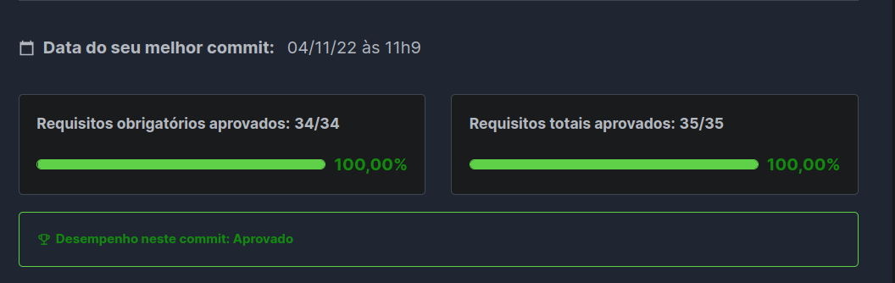

# Trybe Futebol Clube - TFC

## Sobre o projeto

O TFC é um site informativo sobre partidas e classificações de um capeonato de
futebol.

## Tecnologias e frameworks

- Typescript
- Docker
- JWT
- Bcript
- MySQL
- Sequelize ORM
- React
- Mocha
- Chai
- Sinon

## Padrões Arquiteturais e de Design

- MVC
- RESTful

## Descrição

Nesse projeto, pude estudar a construção de um container Docker que armazena o
back-end da aplicação cuja API é consumida por um front-end executado em um
container separado.

Para modelagem da interface entre a aplicação e o banco de dados utilizei o ORM
Sequelize.

O desenvolvimento foi focado nas regras de negócio e orientado a testes (TDD).
Além disso, a API conta com rotas protegidas que são acessadas por meio de
autenticação de usuário (JWT). Para realizar atualizações ou novos registros, o
usuário recebe um token ao se logar no sistema.

## Resultado da Avaliação

# Como executar este projeto

0. Certifique-se que possui Docker instalado em sua máquina
1. Clone o repositório;
2. Acesse o diretório `app`;
3. Execute `docker compose up -d` ;
4. Alimente o banco de dados executando o script `db.example.sql`;

---

  

    <strong>TODO</strong>
  

- [ ] Configurar o Deploy no Railway
- [ ] Refatoração da estrutura para orientação ao Domínio

